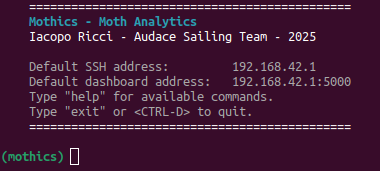

Basics
======

Congratulations! Mothics is installed on your device! Now what?

This section will guide you through the essential features of Mothics,
including the **Dashboard** and the **Command-Line Interface (CLI)**.

Dashboard
---------

The Mothics Dashboard provides a web-based interface for monitoring
and managing sailing data in real-time.

To **access the dashboard**, open a web browser and navigate to:

.. code-block:: sh

   http://192.168.42.1:5000

or, if you properly set up a custom hostname (see Setup/Hostname)

.. code-block:: sh

   http://mothics.local:5000

> **Note:** The first time you start Mothics, ensure you have an
active internet connection. Without it, some resources (such as
external scripts and stylesheets) may not load properly.

The dashboard consists of multiple sections, including:

- **Dashboard Home:** displays real-time navigation, sensor data and plots
- **Logs:** shows the log messages for all of the system components
- **Settings:** manages the system behavior
- **Track Management:** allows users to view recorded sailing tracks

Command-Line Interface (CLI)
----------------------------

Mothics also includes a powerful **command-line interface (CLI)** for
controlling system functions.

To **start** the CLI, run

.. code-block:: sh

   mothics-start

or, alternatively

.. code-block:: sh

   . .venv/bin/activate
   python3 cli.py

if the alias isn't available (see Setup/Advanced setup/Aliases).

The welcome screen should pop up

> **Note:** henceforth, commands to be run inside the Mothics CLI are
indicated by the `(mothics)` prompt.

Commands
^^^^^^^^

Once Mothics is installed and running, you will often need to interact
with it through the **command-line interface (CLI)**. This allows you to
start and stop the system, monitor its performance, manage its
operation, and troubleshoot any issues that arise. Below is a complete
guide on how to properly operate Mothics using the available CLI
commands.

Starting, stopping, and restarting Mothics
''''''''''''''''''''''''''''''''''''''''''

The core of Mothics consists of several processes that handle
different tasks, including data acquisition from sensors, logging, and
visualization through the web-based dashboard.

To **launch** the entire system and begin real-time data collection, use
the command

.. code-block:: sh

   (mothics) start live

When this command is executed, Mothics will initialize all necessary
components, including sensor data collection, storage, and live
visualization. The web dashboard will become accessible at its usual
address (`192.168.42.1:5000` or `mothics.local:5000`), and real-time
data tracking will begin.

If at any point you need to **stop the system** without closing Mothics, you
can do so by running

.. code-block:: sh

   (mothics) stop

This command will terminate all Mothics-related processes, including
the dashboard interface, data logging, and sensor monitoring. The
system will no longer collect or display data. However, stopping
Mothics using this command does not shut down the device itself—only
the Mothics software components. Furthermore, the web interface
remains active, together with the current track and database.

If you suspect that something is not functioning correctly, or if you
have changed certain configuration settings and need to restart the
system with those changes applied, you can **restart** Mothics using

.. code-block:: sh

   (mothics) restart

Restarting will first stop all running processes and then relaunch
them, ensuring a fresh start without requiring a full system reboot.

In some cases, you may want to **reload the configuration file**
(`config.toml`) without closing Mothics. This is useful if you have
made modifications to the configuration file and want
those changes to take effect without completely stopping and
restarting the entire software stack. To do this, you can use

.. code-block:: sh

   (mothics) restart reload_config

Unlike a full restart, this command will apply new configuration
settings dynamically while keeping the system active.

Monitoring system status
''''''''''''''''''''''''

While Mothics is running, it is important to be able to check its
status to ensure that everything is functioning properly.

If you need to confirm that the system is running as expected, you can
check its overall **status** using:

.. code-block:: sh

   (mothics) status

This command provides an overview of the system, including which
services are currently active. If Mothics is not working correctly,
this is the first command you should run to get a general idea of the
situation.

At times, the system may appear slow or unresponsive, and you may need
to check whether resource usage is too high. Mothics provides a
command that allows you to **monitor resource consumption**

.. code-block:: sh

   (mothics) resources

Running this command will show you details about CPU usage, memory
consumption, and other relevant system statistics. If you want to see
only the resource usage of Mothics itself without including the entire
system, you can run:

.. code-block:: sh

   (mothics) resources mothics

Alternatively, if you are interested in seeing overall system-wide
resource consumption, including all processes running on the device,
you can use:

.. code-block:: sh

   (mothics) resources system

Akin to the `watch` command in Unix, `resources` can be continuously
updated every two seconds by running one of the following commands

.. code-block:: sh

   (mothics) resources watch
   (mothics) resources mothics watch
   (mothics) resources system watch
   
   
Managing Mothics
''''''''''''''''

In addition to controlling Mothics itself, there are times when you
may need to manage the Raspberry Pi on which it runs.

For example, if you are finished using the system and want to power it
down safely, you should use the **shutdown** command

.. code-block:: sh

   (mothics) shutdown

This command will completely stop Mothics and power off the Raspberry
Pi. You will need to manually turn the device back on if you want to
use it again.

If you need to shut down and restart the Raspberry Pi, run the
**reboot** command

.. code-block:: sh

   (mothics) reboot

Mothics is frequently updated with improvements and bug fixes. To
ensure that you are running the latest version, you should
periodically **update** the software

.. code-block:: sh

   (mothics) update

it will fetch the latest updates and apply them automatically. For the
updates to take effect, you need to close and reopen Mothics.

Debugging and troubleshooting
'''''''''''''''''''''''''''''

If Mothics (or any dependency, sensor, etc...) is not behaving as
expected, there are several tools available to help diagnose and
resolve issues.

The first thing to check when encountering problems is the **system
logs**. Logs provide detailed information about what Mothics is doing
and can help identify errors or unusual behavior. To view the logs,
run

.. code-block:: sh

   (mothics) log show

This will display a real-time feed of system logs, which can be useful
for identifying the cause of issues. If the logs become too large or
cluttered with old information, you can clear them using

.. code-block:: sh

   (mothics) log clear

If you are experiencing communication issues between Mothics and the
sensors, you may need to check the **raw serial data stream**

.. code-block:: sh

   (mothics) serial_stream

this allows you to see exactly what data is being received from the
remote sensors in real time

You may need to run system commands directly from within the
Mothics CLI. The CLI allows you to **execute shell commands** without
exiting

.. code-block:: sh

   (mothics) shell <command>

or a shorthand version

.. code-block:: sh

   (mothics) !<command>

Help!
'''''

At any time, if you are unsure about a command or need a reminder of
what is available, you can access a complete list of commands

.. code-block:: sh

   (mothics) help

this will display all available commands along with a brief
description of their functions.

Most command come with a brief description and some usage examples,
available using the command

.. code-block sh::

   (mothics) help <command>
